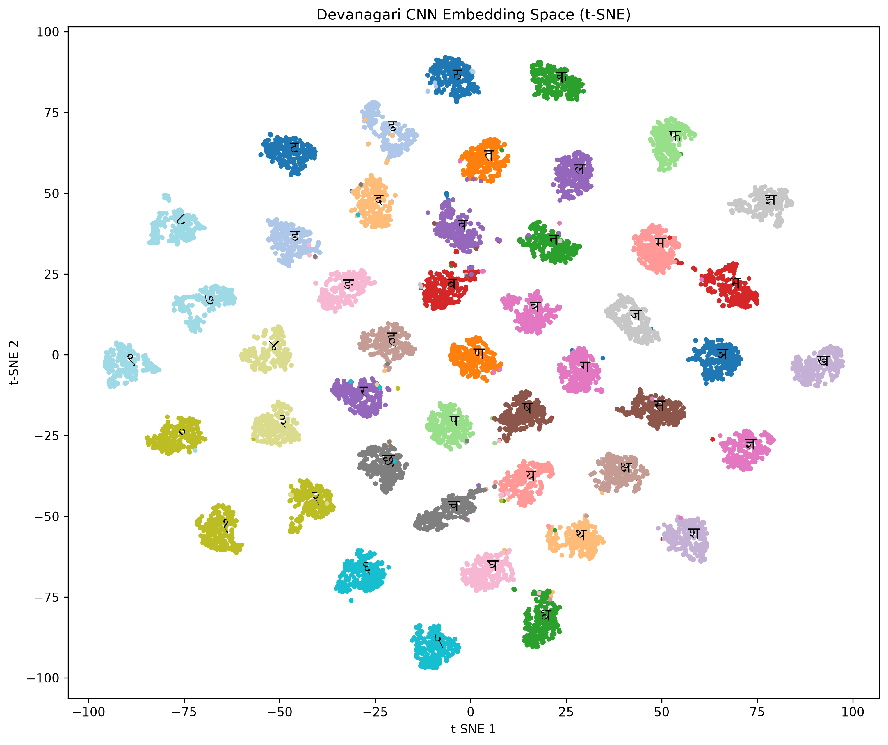

# Devanagari Handwriting Recognition System

<p>   </p>

This project features a live Devanagari handwriting recognition system using a PyTorch CNN, OpenCV, and MediaPipe.

The CNN recognizes 46 Devanagari character classes from digital scratchpad or webcam footage input, allowing users to practice handwriting with real-time model feedback.

## Model

The CNN was trained on 90,000+ handwritten Devanagari characters, using the following dataset:

- [Devanagari Handwritten Character Dataset](https://archive.ics.uci.edu/dataset/389/devanagari+handwritten+character+dataset)

Input images are converted to grayscale and resized to 32×32 pixels before inference.

The model also produces a 64-dimensional embedding from its penultimate layer.

## ONNX Conversion

The trained PyTorch model was exported to ONNX and validated against the original PyTorch model.

Two ONNX versions were produced:

- FP32 (Used)
- INT8

## Benchmark

200 sequential CPU inference calls were used for the model benchmarks.

| Runtime      | Precision | Mean Latency | P95 Latency |     Size |
| ------------ | --------- | -----------: | ----------: | -------: |
| PyTorch      | FP32      |     2.128 ms |    3.855 ms | 2.305 MB |
| ONNX Runtime | FP32      |     0.520 ms |    0.861 ms | 2.299 MB |
| ONNX Runtime | INT8      |     0.612 ms |    1.310 ms | 0.771 MB |

## API Benchmark

The FastAPI inference endpoint was benchmarked separately.

| Metric             |             Result |
| ------------------ | -----------------: |
| Mean latency       |          10.744 ms |
| Median latency     |           8.438 ms |
| P95 latency        |          23.728 ms |
| P99 latency        |          32.584 ms |
| Min latency        |           6.176 ms |
| Max latency        |          68.360 ms |
| Standard deviation |           7.355 ms |
| Throughput         | 93.07 requests/sec |

## Analysis

The model's 64-dimensional embeddings are used to visualize the learned representation space. See `analysis/embedding_tsne.png`:

<p> </p>

The project also includes a confusion matrix to examine which character classes are most frequently confused.

## Running the Project

Start the backend:

```bash
docker compose up
```

The Airpad client can be run with:

```bash
python client/airpad.py
```

The Scratchpad client can be run with:

```bash
python client/scratchpad.py
```