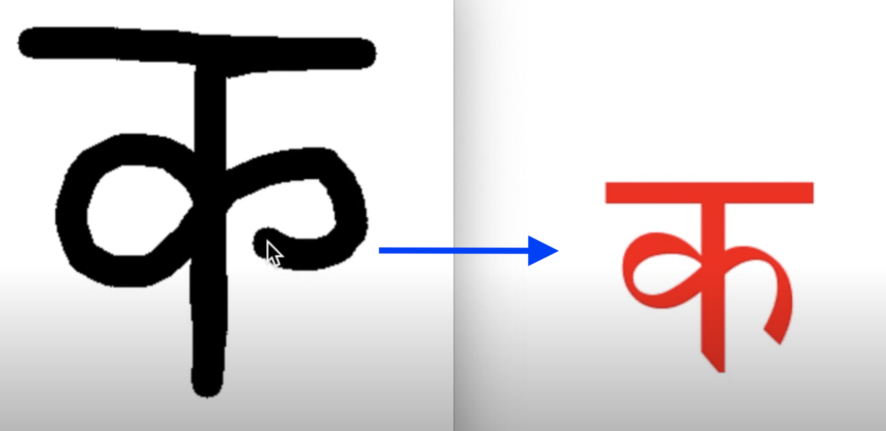
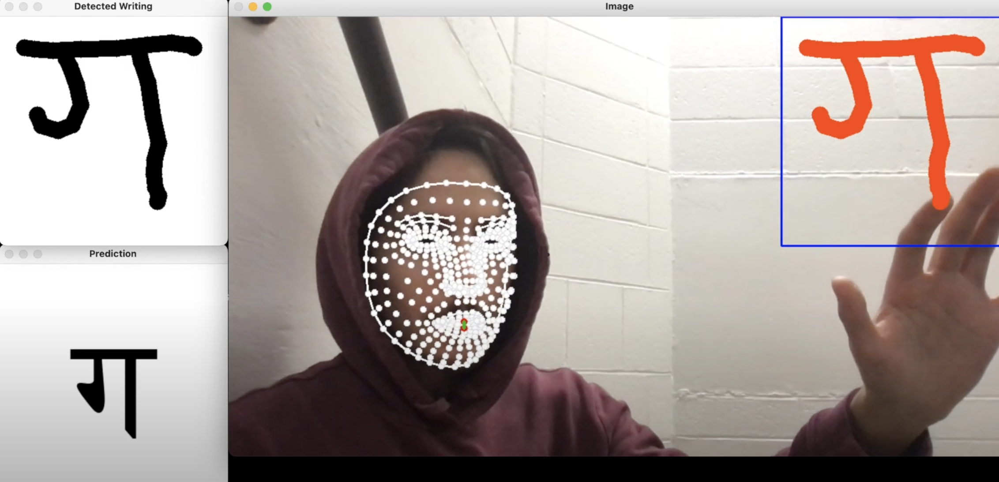

<!-- 

  
  

# Hindi Deep Learning Scratchpad and Airpad
Used a <a href="https://archive.ics.uci.edu/dataset/389/devanagari+handwritten+character+dataset">dataset</a> of 90,000+ handwritten Devanagari characters to develop and train a PyTorch convolutional neural network (CNN). Applied CNN to two <a href="https://www.youtube.com/watch?v=K-BgNTboKrQ">applications</a> below:

## Part I: Scratchpad

Using OpenCV and NumPy, I developed a program to enable users to write characters on an online scratchpad. The CNN receives the image of the handwritten text in the form of a NumPy array and, after
performing matrix transformations, makes a prediction of the character. This process is entirely in real time, and the user receives feedback from the model with an inference latency under 100 milliseconds.

## Part II: Airpad

This is an extension to Part I, where, instead of drawing with a mouse, users can draw in midair with their pointer finger. This is done by using the additional MediaPipe library. First, the user's hand and pointer finger are detected, and their locations are saved. Second, a face mesh is applied to the user's face, and two locations are located and saved: namely, the upper and lower inner lips. This second step is to allow the user to "put down" the finger pen (if their mouth is closed, they are drawing, and if their mouth is open, they are not drawing) to prevent them from drawing when they don't want to. Then, the user's drawing is transformed into an array that the CNN can interpret. Finally, the CNN outputs its prediction of the Hindi letter the user has drawn. This is all done in real time.

## Links
Video Demo for Scratchpad: https://www.youtube.com/watch?v=B65aY0wFP3U

Video Demo (Enhanced Model) for Scratchpad + Airpad: https://www.youtube.com/watch?v=K-BgNTboKrQ -->
